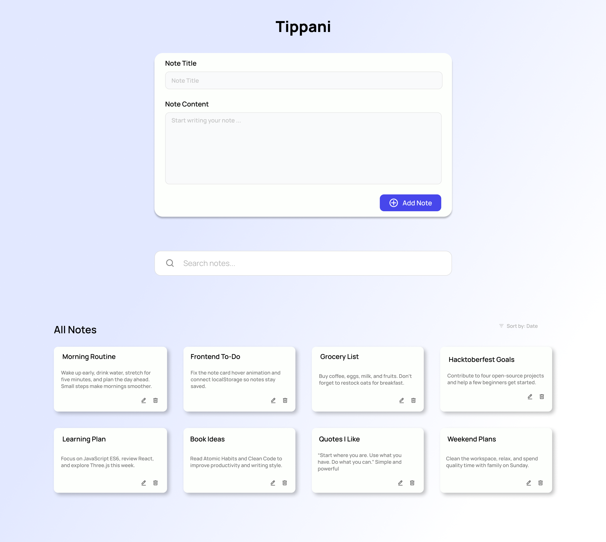
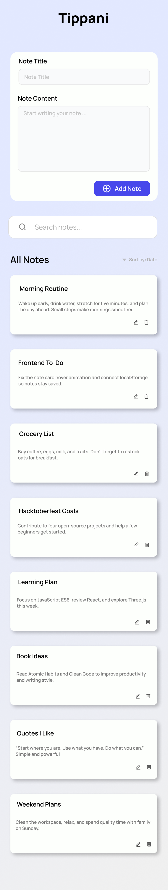

# Tippani — Simple Note-Taking Web App

A tiny, beginner-friendly note-taking web app that stores notes in the browser's localStorage. Great as a small contribution for Hacktoberfest or as a learning exercise for beginners.

Author: Prithivi Pemi Magar

## What this project contains

- `index.html` — Main HTML page with a form to add or edit notes and a search box to filter notes.
- `style.css` — Minimal styling for the app.
- `script.js` — JavaScript logic to create, read, update, delete, and search notes using `localStorage`.
- `svg/` — Icons used by the UI (add/edit/delete/search).

## What it does (short summary)

- Create notes with a title and content.
- Edit existing notes.
- Delete notes with confirmation.
- Search notes live by title or content.
- All notes are saved to `localStorage` under the key `tippaniNotes` so they persist between page reloads in the same browser.

## Why this is good for beginners

- Single-file HTML/CSS/JS — easy to read and modify.
- No build tools or external dependencies.
- Small, self-contained features to practice DOM manipulation and browser APIs.

## How to run locally

1. Open the project folder `web/Tippani` in your file explorer.

Method 1 — Open the HTML file directly (copy/paste path)

1. Locate `index.html` in `web/Tippani`.
2. Right-click the file and choose "Copy as path" (or select the file and copy the full path from your file manager).
3. Open your browser and paste the file path into the address bar. On Windows the browser may accept a path like:

```
file:///a:/Desktop/CodeVault/web/Tippani/index.html
```

or you can simply drag-and-drop `index.html` into a browser window or double-click it to open.

Note: Opening the file directly works for most cases, but some browsers may block or behave differently when loading local assets. If you see missing icons or other issues, use Method 2.

Method 2 — Using VS Code Live Server (recommended)

1. Open the `web/Tippani` folder in Visual Studio Code.
2. Install the "Live Server" extension (search for "Live Server" by Ritwick Dey in the Extensions view).
3. Open `index.html` in the editor, then either:

- Click the "Go Live" button in the VS Code status bar, or
- Right-click the `index.html` editor and choose "Open with Live Server".

4. Your default browser will open a local URL (for example `http://127.0.0.1:5500/`) and the app will load from there.

Using Live Server is recommended because it serves files over HTTP, which matches how browsers load real websites and avoids problems with relative asset loading.

## Data shape (localStorage)

Notes are stored as an array under the `localStorage` key `tippaniNotes`.
Each note is an object similar to:

```json
{
  "id": 1650000000000,
  "title": "My note title",
  "content": "The body of the note.",
  "createdAt": "2025-10-17T00:00:00.000Z",
  "updatedAt": "2025-10-17T00:00:00.000Z"
}
```

## Design & Assets

The project includes design images and a Figma design link used for the UI. Images are stored in the `images/` folder inside this project.

Figma design (open in browser):

https://www.figma.com/design/T7iIAV7ftXjmAkJfSrsrGY/Untitled?node-id=17-28&t=BHODgnHo9nia3ETR-1

Project images (examples):





